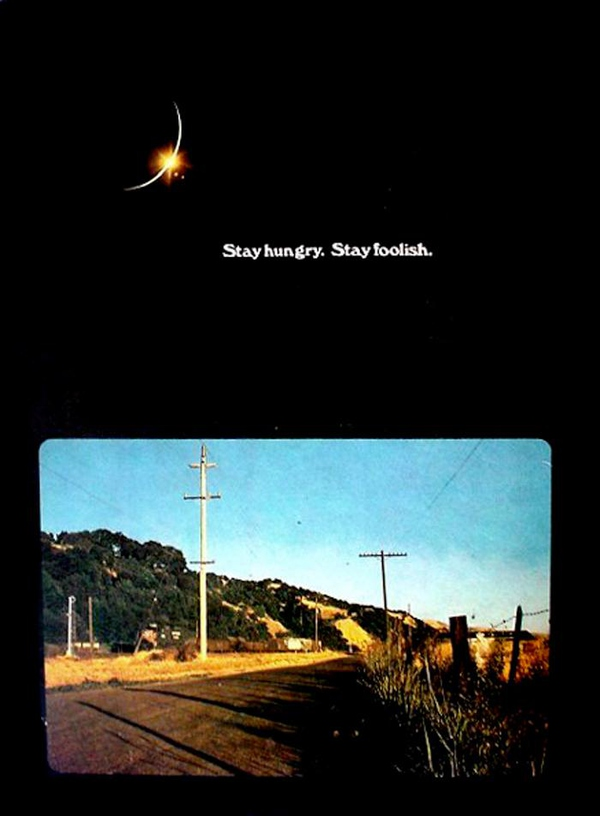

# 乔布斯 2005 斯坦福大学毕业演讲

## 第一个故事讲的是，如何将生活中细微的事情联系在一起。

你无法预测你的未来，但是，当你回顾你所有的人生经历，就会发现他们是如何串联在一起的，凡有所学，皆成性格。你所经历的，就是你的人生。你的性格，爱好，行为习惯，生活环境，朋友，工作，这些都会对一个人产生影响。

## 第二个故事是关于爱和损失。

混乱能够打破常规，产生新的秩序，接受生命中的意外。有时候，你以为失去了什么，或许才是收获的开始。

## 第三个故事是关于死亡。

把生命的每一天当作最后一天来度过，生命才是最宝贵的稀缺资源，不要被教条所束缚，跟随你的内心，不要停止寻找，找到你一生所爱的东西。

三个故事足以显示他对生命、对商业都有着超凡的理解　<a href="http://open.163.com/movie/2006/8/3/8/M7BC8JMHJ_M7BC8PA38.html" target="_blank">[视频地址]</a>

<strong>Stay Hungry, Stay Foolish</strong>

  

