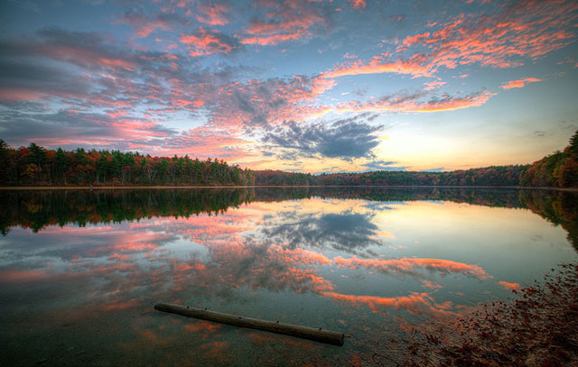

# 瓦尔登湖

时间决定你会在生命中遇见谁，你的心决定你想要谁出现在你的生命里，而你的行为决定最后谁能留下。

最富有的时候，你的生活也是最贫穷的。吹毛求疵的人即便在天堂也能挑出瑕疵。一个安心的人在哪都可以过自得其乐的生活，抱着振奋乐观的思想，如同居住在皇宫一般。犯不着千辛万苦求新，无论衣服还是朋友。把旧的翻新，回到它们中去。万事万物没有变，是我们在变。

一个人若能自信地向他梦想的方向行进，努力经营他所想的生活，他是可以获得通常还意想不到的成功的。

