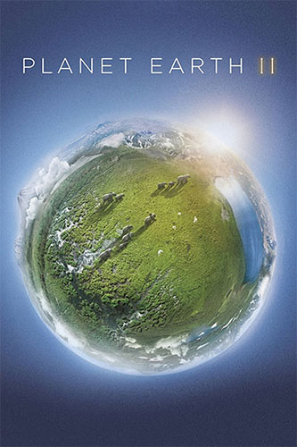
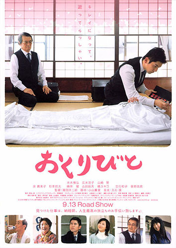
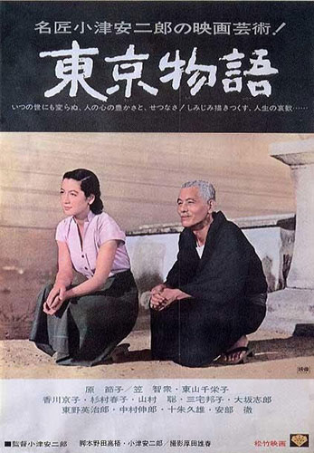

# 人生最大的意义是什么？

今天看了纪录片<a href="https://movie.douban.com/subject/26733371/" target="_blank">《地球脉动 2》</a>，里面的动物，还没出生就有可能面对死亡，能够活下来，对于他们来说，已经是非常幸运的事。所以，作为人类，也应该感激，在这个星球上，活着，就是非常幸运的事。

看完<a href="https://movie.douban.com/subject/2149806/" target="_blank">《入殓师》</a>，对于死亡的意义让我不得不重新思考。

看完<a href="https://movie.douban.com/subject/1291568/" target="_blank">《东京物语》</a>，死亡仿佛就在我们身旁，有些人，一个转身，就不在了。

我不得不思考着：**人生最大的意义是什么？**

有些人可能会说：改变世界。是的，有些人，仅仅是一小部分人，他们生来的伟大使命就是改变世界。但他们并不是一开始就可以改变世界的，而是先要改变自己。

我认为人生最大的意义是：改变自己，每天使自己都要比昨天更完善，心灵才能得到净化。

人生就是一个不断修炼的过程，当到达人生的终点时，一切皆可坦然面对，因为你的内心足够完整，你的精神世界是如此的富有。

勇敢面对未知的死亡，不要犹豫，这只是一个过程
