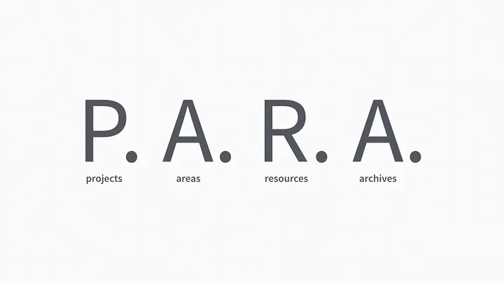

# PARA 方法

> **组织你生活的最终系统是一个*可操作的*系统**

## 为什么需要知识体系管理

我们大多数人组织信息的方式都是很混乱的，而且实操性不强，想要找到对应的资源时，往往需要花费更多时间，看着日益增长的文件夹，一层嵌套一层，导致后来许多文件，淹没在海底

那么有没有一套简洁，实操性强的知识体系管理方法呢，于是我就找到了 P.A.R.A 方法

## 什么是 PARA 方法

> **它称为 PARA，一个简单、全面但极其灵活的系统，用于跨任何平台组织任何类型的数字信息。**

Tiago Forte（「创建第二大脑」课程的创始人）提出了一套整理信息的方法，由四个部分组成：

### **Projects**

你现在正在积极做的事情，有一个明确的截至日期

### **Areas**

您工作和生活中需要持续关注的重要部分，並且沒有结束日期（跟个人高度相关的，比如你的专业，健康等）

### **Resources**

你感兴趣的话题在将来可能会有用（兴趣相关）

### **Archives**

其他三个类别中已完成或未完成的项目

### 例子：

- Projects
  - 产品发布
  - 生日聚会
  - 销售演示
  - 马拉松训练
- Areas
  - 生产力
  - 健康
  - 旅行
  - 财务
- Resources
  - 科幻小说
  - 食谱
  - 园艺
  - 幻灯片模板
- Archives
  - 您已完成或搁置的项目
  - 不再活跃或相关的领域
  - 您不再感兴趣的资源

## 按项目和目标来组织你的信息

优先按照项目（Projects）来组织你的信息，因为这样具有更强的可实操性

## 该在哪一层放置你的资料？

如果你不清楚该放在哪一层，有几个简单步骤可以判断

- 这是否能帮助我推动当前的项目或目标的进展？
  - YES → Project
  - No → 这是否能帮助我坚守一个领域的职责？
    - YES → Area
    - NO → 它能否支持我的一个我的兴趣和好奇心？
      - YES → Resource
      - NO → 它是否真的值得保留吗？可能不值得!

> PARA——**组织你生活的最终系统是一个*可操作的*系统**

## 参考资料

- [https://fortelabs.com/blog/para/](https://fortelabs.com/blog/para/)
- [https://www.youtube.com/watch?v=HvSBfnQmEiU&t=417s](https://www.youtube.com/watch?v=HvSBfnQmEiU&t=417s)
- [https://www.youtube.com/watch?v=AsJ0EL8ffro](https://www.youtube.com/watch?v=AsJ0EL8ffro)
- [https://www.youtube.com/watch?v=8H0aIqtcaRA&t=157s](https://www.youtube.com/watch?v=8H0aIqtcaRA&t=157s)
